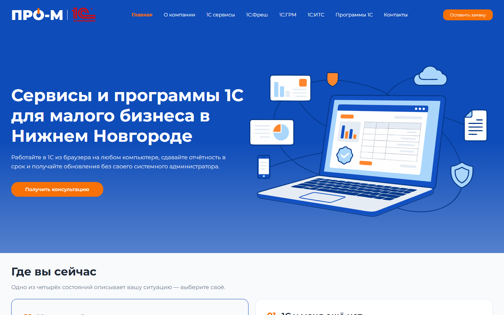

<div align="center">

# prom-site 🧩

### Корпоративный сайт · партнёр 1С в Нижнем Новгороде

*каждое слово на сайте правится в админке — без деплоя и пересборки*


[](https://www.pm52.ru)
[](https://www.figma.com/design/MhQUztZQARwwwbrzVjKCNX/)

</div>

---

## 📋 о проекте

Редизайн и разработка с нуля корпоративного сайта **НПП «ПРО-М»** — официального партнёра 1С, который продаёт и сопровождает программы и облачные сервисы 1С для малого бизнеса. Сайт заменил прежний, на WordPress, и работает на **[pm52.ru](https://www.pm52.ru)** с октября 2026.

Мой первый коммерческий проект, сделан в одиночку: макет в Figma, модель данных и код — мои.

Главное требование заказчика: **весь текстовый контент правится в админке**, без правок кода и без деплоя.



## ✨ возможности

- 🗂️ Каталог из **61 сервиса** в 10 категориях — мгновенный поиск в памяти, сайдбар со счётчиками, флаги «Популярное» и «Новинки»
- 🪟 Попап сервиса со своим адресом: открывается поверх каталога, закрывается кнопкой «назад», а по прямой ссылке тот же адрес отдаёт отдельную страницу для поисковиков
- 📝 Форма заявки с отдельным, не отмеченным заранее чекбоксом согласия — в каждой заявке хранятся время согласия, IP и версия политики
- 🍪 Cookie-баннер с тремя категориями и версией согласия — карта Яндекса загружается только после разрешения посетителя
- ✏️ Правится всё: страницы, тарифы, вопросы и ответы, отзывы, юридические документы, контакты — кеш сбрасывается при сохранении
- 🧱 Схема базы меняется только миграциями, без автоматической подгонки
- 🔁 Редиректы 301 со старых адресов WordPress и 410 для удалённых разделов — до канонического адреса за один переход
- 🗺️ `sitemap.xml`, `robots.txt`, своя страница 404 и метаданные страниц — из базы
- 📱 Адаптив: десктоп, планшет (до 1199px) и телефон (до 767px)
- ♿ Один `<h1>` на странице, видимый фокус, порядок обхода табом совпадает с раскладкой

## 🧭 страницы

| Маршрут | Страница |
|---|---|
| `/` | Главная |
| `/about` | О компании |
| `/services`, `/services/[category]` | Каталог сервисов 1С |
| `/services/[category]/[slug]` | Страница сервиса × 61 |
| `/fresh`, `/grm`, `/its` | Продуктовые страницы: 1С:Фреш, 1С:ГРМ, 1С:ИТС |
| `/programs/[slug]` | Программы 1С × 7 |
| `/contacts` | Контакты и карта офиса |
| `/privacy`, `/cookie`, `/consent` | Юридические документы |
| `/admin` | Админка Payload |

## 🛠️ стек

- **Фреймворк:** Next.js 16 (App Router) + React 19
- **CMS:** Payload CMS 3, встроена в то же приложение Next.js
- **База данных:** SQLite через адаптер Payload на Drizzle
- **Язык:** TypeScript
- **Стили:** CSS Modules и дизайн-токены, выгруженные из Figma
- **Шрифт и иконки:** Montserrat и Material Symbols через Iconify лежат локально — с CDN не грузится ничего
- **Тесты:** Playwright (e2e) и Vitest (интеграционные)
- **Инструменты:** ESLint 9, Prettier, pnpm

## 🗃️ структура проекта

```
src/
  app/
    (frontend)/      страницы, layout, tokens.css
    (payload)/       админка и маршруты API
  collections/       Services, Categories, Programs, Reviews, Leads, LegalPages, Media, Users
  globals/           Home, About, Contacts, Fresh, GRM, ITS, Settings, CookieBanner…
  components/        компоненты по разделам: layout, home, catalog, product, about, contacts, cookie
  lib/               запросы, ревалидация, согласие на cookie, редиректы со старого сайта
  migrations/        история схемы базы
  seed/              сиды контента
  proxy.ts           канонический домен, 301 и 410
tests/
  e2e/               Playwright
  int/               Vitest
```

## 🚀 запуск

Нужны Node.js 20.9+ и pnpm.

```bash
git clone https://github.com/zeawale/prom-site.git
cd prom-site

cp .env.example .env
# в .env задать PAYLOAD_SECRET

pnpm install
pnpm migrate
```

Наполнить базу. Порядок важен: `pnpm seed` идёт первым, остальные сиды ссылаются на каталог, который он создаёт.

```bash
pnpm seed
pnpm seed:programs
pnpm seed:its
pnpm seed:fresh
pnpm seed:grm
pnpm seed:legal
pnpm seed:home
pnpm seed:reviews
pnpm seed:pages
pnpm seed:cookie
```

```bash
pnpm dev
```

Сайт откроется на `http://localhost:3000`, админка — на `http://localhost:3000/admin`. При первом входе она предложит создать администратора.

## 📜 команды

| Команда | Что делает |
|---|---|
| `pnpm dev` | Сервер разработки |
| `pnpm build` | Продакшен-сборка — единственный шаг, где проверяются типы |
| `pnpm start` | Запуск собранного сайта |
| `pnpm lint` | ESLint |
| `pnpm test:e2e` | Сквозные тесты на Playwright |
| `pnpm test:int` | Интеграционные тесты на Vitest |
| `pnpm migrate` | Применить миграции базы |
| `pnpm migrate:create <имя>` | Создать миграцию по изменениям схемы |
| `pnpm generate:types` | Пересобрать `payload-types.ts` |

Деплой на сервер — по шагам в [`deploy/README.md`](deploy/README.md): Ubuntu, nginx, systemd, ежедневный бэкап, обновление одной командой.

## 🧪 тесты

114 сквозных тестов: дымовой прогон по всем маршрутам (статус, ошибки в консоли, единственный `<h1>`), форма заявки, cookie-баннер, попап каталога и поиск, Метрика под согласие и цель на заявку, редиректы, 404, sitemap и robots.

```bash
pnpm test:e2e --workers=1
```

> На dev-сервере тесты надёжнее гонять в один поток: в параллельном прогоне они моргают.

---

<div align="center">
<sub>Коммерческий проект · дизайн и разработка: zeawale · 2026</sub>
</div>
